<!-- BANNER SVG -->


root@qqq:~$ whoami
> Aspiring Exploit Developer & Offensive Security Researcher
> Focused on understanding how systems break at a fundamental level.
> If it crashes, I'm interested.
---

## About.txt

I don't chase shortcuts. I chase root causes.

My path in security isn't about running scripts someone else wrote — it's about understanding every byte, every register, every instruction that leads to a crash, a leak, or a shell. I work at the intersection of low-level systems and offensive security, building my foundation one vulnerability at a time.

Current trajectory:
Understanding vulnerabilities  →  Building reliable exploits  →  Exploring new attack surfaces
> *"Segmentation fault? More like invitation for me."*

---

## Toolkit


---

## Skills --list

### Malware Analysis
- Static & dynamic analysis of real-world ransomware (WannaCry)
- Execution flow reconstruction and component mapping
- Propagation mechanics, encryption routines, C2 behavior
- Runtime tracing via debugging and behavioral observation

### Binary Exploitation
- Stack-based buffer overflows — offset discovery, EIP/RIP control
- Memory layout understanding and control flow hijacking
- GDB + pwndbg for debugging and exploit development
- Transitioning: 32-bit → 64-bit exploitation

### 🔍 Reverse Engineering
- Static analysis with Ghidra — function recovery, CFG reconstruction
- Dynamic analysis — breakpointing, tracing, memory inspection
- System call behavior and runtime memory interactions

### Vulnerability Research
- Root cause analysis methodology
- Real-world exploit write-up study
- Common vulnerability pattern recognition

---

## Workflow --show

#!/bin/bash
# QQQ Exploit Development Workflow

```
steps=(
  "01_RECON    → Map the target surface"
  "02_ANALYSIS → Understand the binary"
  "03_DEBUG    → Find the crash point"
  "04_EXPLOIT  → Build reliable control"
  "05_DOCUMENT → Write it up properly"
)

for step in "${steps[@]}"; do
  echo "[+] $step"
  sleep 0.5
done

echo "[*] Repeat until root."
```
---

## Milestones --status

| Status | Milestone |
|--------|-----------|
| ✅ | Build and exploit a vulnerable C binary (stack buffer overflow) |
| ✅ | Perform full malware analysis — WannaCry ransomware |
| 🔄 | Transition from 32-bit → 64-bit exploitation |
| 🔄 | Deepen understanding of stack internals |
| 🎯 | CEDP Certification from CWL *(Started)* |
| 🎯 | Contribute technical research to the security community |

---

## Philosophy

DEPTH     over shortcuts
CONSISTENCY  over intensity
UNDERSTANDING   over memorization
I believe the difference between a script kiddie and a real exploit developer is one thing: knowing why it works. Every crash is a teacher. Every segfault is a map. I'm here to read both.

---

## Projects --ls

.
├── Cyber-in-Somali/              # Cybersecurity education in Somali language
│   ├── Core-Concepts/            # Computer arch, memory, assembly, buffer overflow
│   └── Binary-Exploitation-CTFs/ # Capture the Flag writeups
│
└── Malware-Analysis/
    └── WannaCry-Ransomware/      # Full static + dynamic analysis
        └── Evidence/             # 23 documented evidence files
> Cyber-in-Somali — Making offensive security knowledge accessible to Somali speakers. Because knowledge shouldn't have a language barrier.

---
